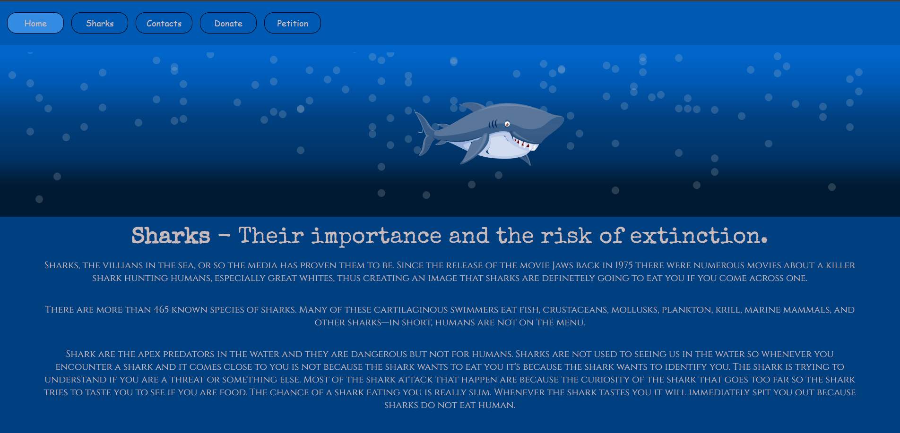
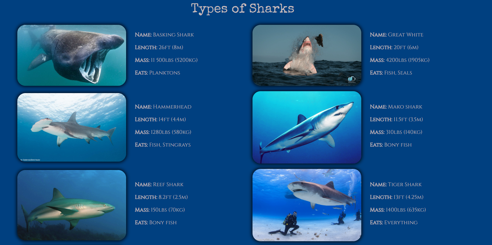

# 🦈 Shark World - A Shark Awareness Website  

🚀 **Live Demo:** [Visit the Website](https://vladig98.github.io/SharkWorld/index.html)  

A **static website** built with **HTML, JavaScript, and SASS**, designed to **educate, engage, and inspire** users about the fascinating world of sharks. This project was developed as part of a **web development fundamentals course** and serves as a **project defense exam**.  

## 🌊 Features  

- **Visually Appealing Design** – Styled with **SASS** for a modern and responsive UI.  
- **Interactive Elements** – JavaScript-powered **animations, hover effects, and dynamic content**.  
- **Educational Content** – Covers **various shark species, habitats, and conservation efforts**.  
- **Engaging User Experience** – Includes **interactive information cards, quizzes, and more**.  

## 🚀 Technologies Used  

- **HTML** – Structured and semantic markup.  
- **JavaScript** – Adds interactivity and dynamic elements.  
- **SASS (SCSS)** – Enhances styling with modular, maintainable code.  

## 📸 Screenshots  

### Homepage  


### Shark Details Page  
  

## 🛠️ Installation & Setup  

1. Clone the repository:  
   ```bash
   git clone https://github.com/vladig98/SharkWorld.git
   cd SharkWorld
2. Open `index.html` in a browser to explore the website.  

## 📌 Project Purpose  

This project demonstrates **a solid understanding of front-end development**, structured styling with **SASS**, and JavaScript-driven interactivity. It also raises **awareness about shark conservation** while showcasing modern web development skills.  

## 🐋 Contributing  

Contributions are welcome! Feel free to **fork** the repository, create a **new branch**, and submit a **pull request**.  

## 📄 License  

This project is licensed under the **MIT License**.  

---  

**🌊 Let’s spread awareness and appreciation for sharks! 🦈**  